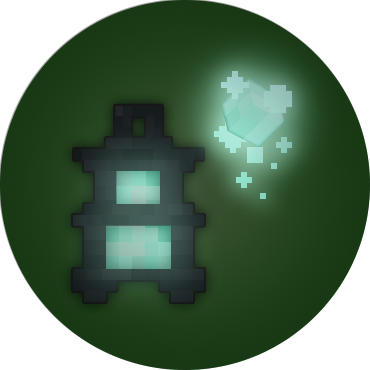
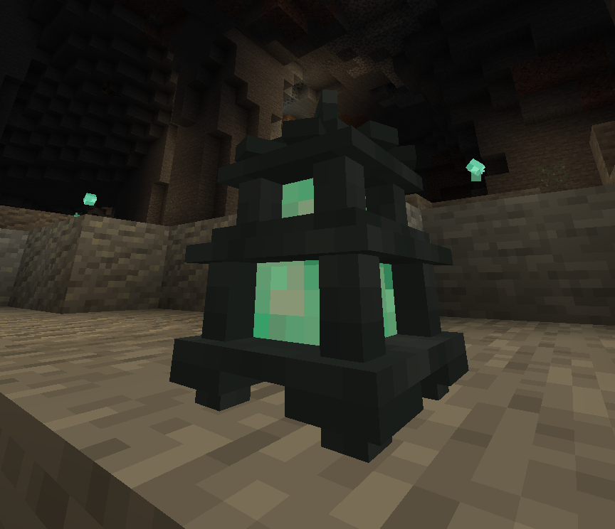

#  GhostZ 

GhostZ is a small lightweight **FabricMC** mod. It adds a very unique **Ghost Lantern** item/block with which you will never need torches during your cave or stripmine sessions again!

## Dependencies
- [Fabric API](https://www.curseforge.com/minecraft/mc-mods/fabric-api)

<!-- ### Optional
- [Trinkets](https://www.curseforge.com/minecraft/mc-mods/trinkets) -->

## Features
- unique item **Ghost Lantern**, which:
  - is an upgrade of vanilla **Soul Lantern**
  - can place small **wisps** - temporary light sources, draining **souls meter**, wisps can be sucked all at once to restore the meter
  - **levels up** during your adventures (by killing mobs)
  - can be crafted into a placeable lantern

> Learn more on [Wiki](https://github.com/itzTerra/GhostZ/wiki)

## Configuration, Modpacks & Balance
You can configure and balance this mod through `config/ghostz.json` file.  
Feel free to use this mod in any modpack, it *shouldn't* break anything :).

## Plans
- cooler visuals
- add Haunted Graveyard/Crypt structures with naturally spawning Ghost Lanterns
- **Trinkets** support
- *...ghosts?*

> and more in [Discussions](https://github.com/itzTerra/GhostZ/discussions/3)

## Issues & Suggestions
- Create an Issue, PR or Discussion on [**GitHub**](https://github.com/itzTerra/GhostZ/).
- DM me on [**Discord**](https://discordapp.com/users/273461148441903105/).

### Help welcome!
I am very new at modding and this project is open-source, so anyone is welcome to help me make these ideas come to life or even come up with new ones.